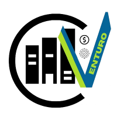

---

Sou desenvolvedor técnico de sistemas e estou em processo de formação em Engenharia de Software e técnico em eletroeletrônica. Gosto de propor soluções à problemas, busco visualizar de forma sistêmica os processos e trabalhar em equipe. Sou proativo, altruísta, organizado e flexível. 

Trabalho com desenvolvimento de sistemas web e mobile com as seguintes tecnologias de front-end: REACT; VITE; REACT NATIVE; CSS; HTML; JS; WordPress; Bootstrap. E back-end: API REST com Node; JS; ORM'S; SQL Query Builder; SGBD SQL e NoSQL (mongoDB); Express; JWT; Google Cloud Plataform (GCP). Além disso, tenho alguns conhecimentos em treinamentos de modelo de IA com a GCP.

Procuro estar sempre aprendendo algo novo para me atualizar as novas tendências, para superar desafios e entregar soluções alinhadas as metodologias ágeis como Scrum e Kanban, ou 5S, de forma que seja alcançadas as metas propostas e haja evolução como profissional.

---

## 🚀 Minhas estatísticas no GitHub

  
  

---

## 🛠️ Tecnologias que utilizo

  
   
   
  
  
  
  
  
   
   
   
   
  
   
  

---

## 🌟 Destaques

<table align="center"> <tr> 
<td align="center" width="33%">   <strong>DIO Campus Expert | Turma 12</strong>  <em>Programa Realizado</em>  <a href="https://www.dio.me/users/guipedromilo">Ver Perfil na DIO →</a></td> <td align="center" width="33%">   <strong>Heineken - IA com Copilot</strong>  <em>Bootcamp Realizado</em>  <a href="https://github.com/GuilhermeVeigaPedromilo/Desafios-de-projeto-Bootcamp-HeinekenIntelig-nciaArtificialAplicadaADadosComCopilot.git">Ver repositório →</a></td><td align="center" width="33%">   <strong>Suzano Python Developer</strong>  <em>Bootcamp Realizado</em>  <a href="https://github.com/GuilhermeVeigaPedromilo/Suzano---Python-Developer.git">Ver repositório →</a></td></tr><tr><td align="center" width="33%">   <strong>Venturo ERP</strong>  <em>Participação no desenvolvimento</em>  <a href="https://github.com/Venturo-s-Dev-Team">Ver no GitHub →</a> </td> <td align="center" width="33%">   <strong>PixelBank</strong>  <em>Protótipo de app bancário</em>  <a href="https://github.com/GuilhermeVeigaPedromilo/_Project_Pixel_Prophets_.git">Ver no GitHub →</a> </td><td align="center" width="33%">   <strong>SP-Medical Group</strong>  <em>Site clínico - Primeiro projeto</em>  <a href="https://github.com/GuilhermeVeigaPedromilo/SP-Medical-Group-SENAI">Ver no GitHub →</a> </td></tr> </table>

---

## 📫 Perfis e contatos

- **LinkedIn:** [Guilherme Veiga Pedromilo](https://www.linkedin.com/in/guilhermeveigapedromilo/)
- **DIO public profile:** [Guilherme Veiga Pedromilo](https://www.dio.me/users/guipedromilo)
- **E-mail:** guipedromilo@gmail.com
