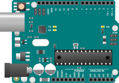
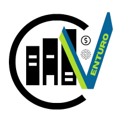

---

**PT-BR** - 
Eu sou estudante de Engenharia de Software, bolsista pelo ICETI (Instituto Cesumar de Tecnologia e Inovação), técnico em desenvolvimento de sistemas e eletroeletrônica e também sou músico. Atualmente trabalho como aprendiz no setor de TI da Kolbenschmidt Pistons Brazil, executando funções da área de suporte e help desk.

Gosto de estudar e desenvolver soluções digitais como sistemas web, mobile, desktop ou IoT versionadas pelo GitHub e desenvolvidas com JavaScript, Typescript, C/C++,  Arduino, HTML/CSS e bibliotecas como o React.js e React Native, utilizando bancos de dados como MySQL, SQLite e MongoDB através de metodologias como Scrum/Kanban, 5S e 8D. Além disso, gosto de automação de processos com ferramentas da Microsoft (exemplo: Excel, Power Point, Power BI e Word) e instalações elétricas e eletrônicas no geral.

Possuo conhecimentos básicos em ferramentas de Cloud Computing como o Google Cloud Platform e Azure para instanciar VMs, gerenciar instâncias e integrações com IA.

Busco sempre estar atualizado com as tendências do mercado e me desafiar com novas oportunidades para desenvolver habilidades técnicas e sociais, impactando positivamente em atividades em time, na minha organização e flexibilidade.

---

**EN** -
I'm Software Engineering student, scholarship holder by ICETI, technician in systems development and electroelectronic and also I'm musician. Currently I work as an apprentice from  IT sector at the Kolbenschmidt Pistons Brazil, performing functions of the support and help desk area.

I like to study and develop digital solutions like web, mobile, desktop and IoT systems versioned by GitHub and developed with JavaScript, Typescript, C/C++, Arduino, HTML/CSS and libraries as the react.js and React Native, using databases like MySQL, SQLite e MongoDB through of methodologies as like Scrum/Kanban, 5S and 8D. Furthermore, I like process automation using Microsoft tools (Excel, Power BI, Power Point and Word) and electroelectronic installations in general.

I have basic knowledge in cloud computing tools as the Google Cloud Platform and Azure to the instance VMs , management instances.

I always search to keep me updated with the market tendencies and challenge me with the new opportunities to the develop technical and socioemecional skills, it's resulting in a great impact in activities with the team, my organization and flexibility.

---

## 🚀 Minhas estatísticas no GitHub

  
  

---

## 🛠️ Tecnologias que utilizo

  
   
   
  
  
  
  
  
   
   
   
  
   
  

---

## 🌟 Destaques

<table align="center"> 
<tr>
<td align="center" width="33%">   <strong>Ugrow Social App</strong>  <em>Projeto Universitário em Desenvolvimento</em>  <a href="https://github.com/Ugrow-Social-App">Ver Organização →</a></td>

<td align="center" width="33%">   <strong>Santander 2025 - Front-End</strong>  <em>Bootcamp Realizado</em>  <a href="https://github.com/GuilhermeVeigaPedromilo/Bootcamp_Santander_2025_Front_End.git">Ver repositório →</a></td> <td align="center" width="33%">   <strong>CLP Educacional</strong>  <em>Projeto Realizado</em>  <a href="https://github.com/GuilhermeVeigaPedromilo/CLP_SENAI">Ver repositório →</a></td>

</tr>
<tr>
<td align="center" width="33%">   <strong>DIO Campus Expert | Turma 12</strong>  <em>Programa Realizado</em>  <a href="https://www.dio.me/users/guipedromilo">Ver Perfil na DIO →</a></td>

<td align="center" width="33%">   <strong>Heineken - IA com Copilot</strong>  <em>Bootcamp Realizado</em>  <a href="https://github.com/GuilhermeVeigaPedromilo/Desafios-de-projeto-Bootcamp-HeinekenIntelig-nciaArtificialAplicadaADadosComCopilot.git">Ver repositório →</a></td><td align="center" width="33%">   <strong>Suzano Python Developer</strong>  <em>Bootcamp Realizado</em>  <a href="https://github.com/GuilhermeVeigaPedromilo/Suzano---Python-Developer.git">Ver repositório →</a></td>

</tr>
<tr> 
<td align="center" width="33%">   <strong>Venturo ERP</strong>  <em>Projeto Realizado</em>  <a href="https://github.com/Venturo-s-Dev-Team">Ver no GitHub →</a> </td>

<td align="center" width="33%">   <strong>PixelBank</strong>  <em>Protótipo de app bancário</em>  <a href="https://github.com/GuilhermeVeigaPedromilo/_Project_Pixel_Prophets_.git">Ver no GitHub →</a> </td>

<td align="center" width="33%">   <strong>SP-Medical Group</strong>  <em>Site clínico - Primeiro projeto</em>  <a href="https://github.com/GuilhermeVeigaPedromilo/SP-Medical-Group-SENAI">Ver no GitHub →</a> </td>
</tr> </table>

---

## 📫 Perfis e contatos

- **Portfólio Profissional:** [Guilherme Veiga Pedromilo](https://guilhermeveigapedromilo.github.io/GuilhermeVeigaPedromilo/)
- **LinkedIn:** [Guilherme Veiga Pedromilo](https://www.linkedin.com/in/guilhermeveigapedromilo/)
- **DIO public profile:** [Guilherme Veiga Pedromilo](https://www.dio.me/users/guipedromilo)
- **E-mail:** guipedromilo@gmail.com
